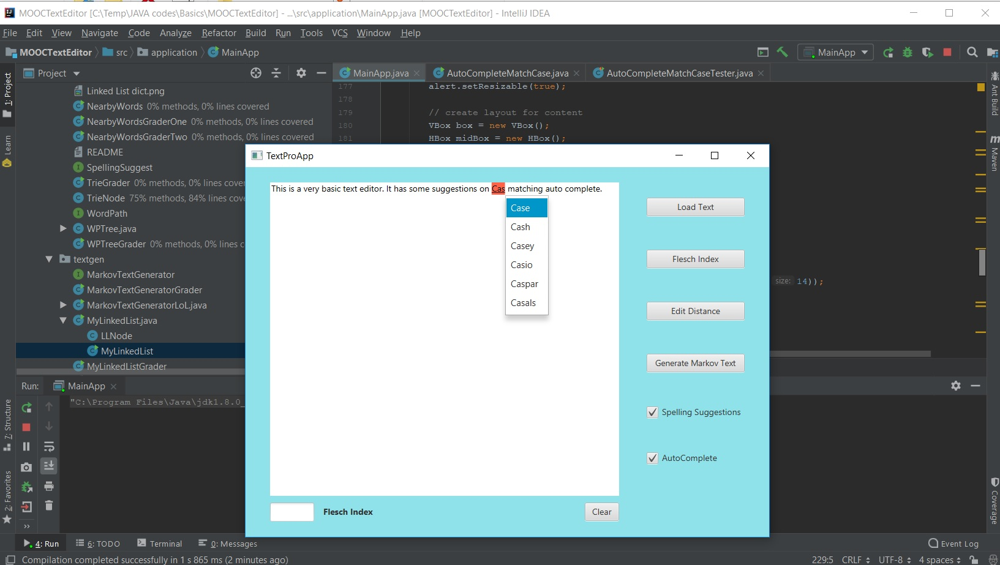

# Text_Editor

Course Name: Data Structures and Performance

Descriptions: Online course offered by University of San Diego through Coursera.

I learned a bit about JAVA. The course pushes Eclipse IDE, but I used IntelliJ IDEA, so my folder structure might be a bit different from the standard of the course.
If you are doing the course and want to use this as a reference, and if you like my code and you use it for your benefit, please be kind and upvote it. It seems nowadays people like upvotes more than anything. If you like JAVA, you are already a better person than me. I did all the optional assignments. 

      |\_/|      ___ ___ ___ ___ ___ ___ ___ ___ 
      (. .)  __ / I am pretty confident my
       =w= (\   \ code for the linkedList, Markov
      / ^ \//    \ text generator, autocomplete with
     (|| ||)      \ matching letter case are the best than
     ,""_""_ .     \ everyone else I did the course together.
                     ---- ---- ---- ---- ---- ----

The course compresses in a refresh of Strings methods, some efficiency Analysis and Benchmarking (BigO), Interfaces, Linked Lists vs. Arrays, a basic Markov Text Generator, Trees (including Binary Search Trees and Tries for simple autocomplete and spelling), Hash Maps and Distance of words space.
The most important aspect of this course is helping on how to accommodate and separate parts of code and an intro to unit testing by JUNIT. At least in this project you feel that you make something by yourself unlike the previous course (that uses UnfoldingMap).

If you want to try this piece of program (garbage) to see how much effort someone can put and the result is just heh, download both the jar file with the data folder (dictionary for spelling corrections). So much effort for this. Am I proud of me for doing this? No. But this is a good beginning.
